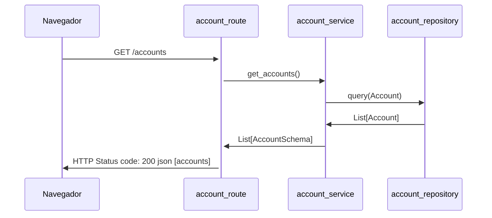
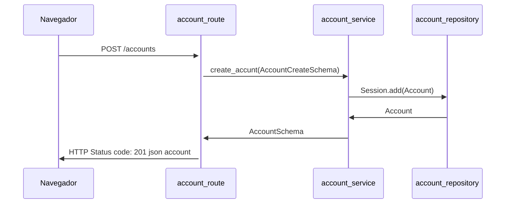

# New Life Bank

## Aula 25/10/2021

### 1) Abra o vscode através do terminal e acesse a pasta new_life_bank.
```
code .
```
### 2) Habilite o terminal no modo Git Bash. <br/><br/>

### 3) Ativar o ambiente virtual
```
source venv/Scripts/activate
```
```(venv)  ```

### 4) Para rodar o servidor no terminal
```
python main.py
```

### 5) Realizar testes no servidor:
* browser (http://127.0.0.1:8000/)
* browser (http://127.0.0.1:8000/docs/)
### Realizar testes no /health
* [GET]   thunder-client (http://127.0.0.1:8000/health)
### Buscar todas contas cadastradas:
* [GET]   thunder-client (http://127.0.0.1:8000/Accounts)
### Adicionar uma nova conta:
* [POST]  thunder-client (http://127.0.0.1:8000/Accounts/)
### Buscar todas transferências realizadas:
* [GET]   thunder-client (http://127.0.0.1:8000/Transactions)
### Realizar uma transfêrencia:
* [POST]  thunder-client (http://127.0.0.1:8000/Transactions/)

## Diagrama de Sequencia
### GET /accounts



### POST /accounts
