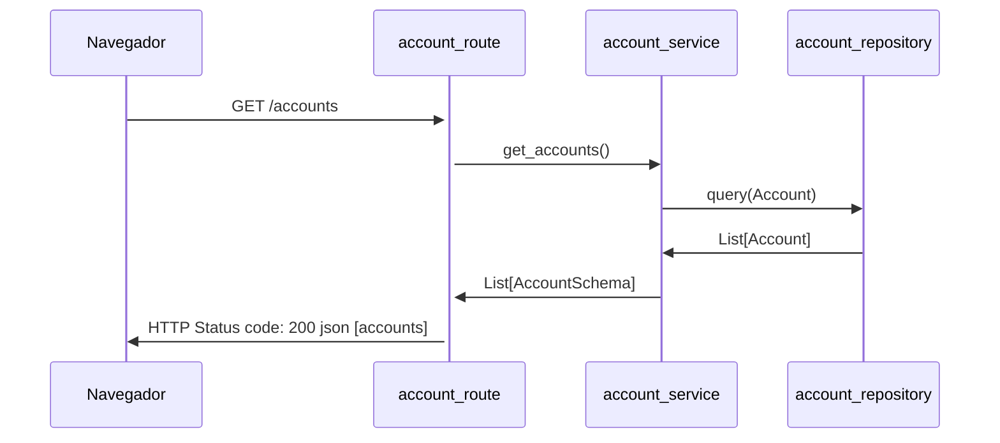
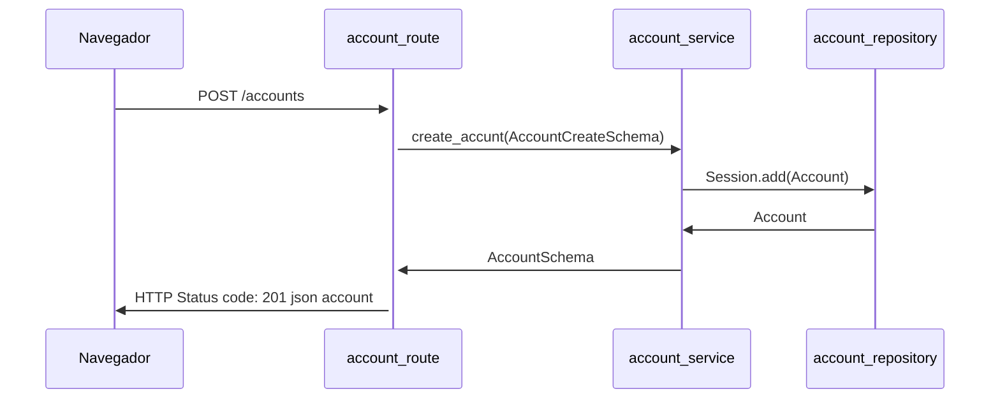

# New Life Bank

## Aula 06 para 07

### Configurando o ambiente via gitpod
#### 1) Entre na url abaixo
```bash 
https://www.gitpod.io/
```
#### 2) Logue e configure uma nova workspace para url abaixo:
```bash 
https://github.com/gusx42/life-bank
```


## Configurando o projeto
Caso você esteja em um ambiente local execute os passos abaixo dentro da pasta do projeto no terminal do vscode
#### 1) Instalar o ambiente virtual
```bash 
pip3 install virtualenv
```
#### 2) Verifique a versão do virtualenv
```bash
virtualenv --version
```
#### 3) Crie um ambiente virtual
```bash
python -m virtualenv venv
```
#### 4) Ativar o ambiente virtual
```bash
source venv/bin/activate
```
### 5) Para rodar o servidor no terminal

```bash
python app/main.py
```

### 5) Para rodar o servidor no terminal

```bash
pip install -r requirements.txt
```

## Iniciando e terminando o docker-compose

### Iniciando o compose 
```sh
docker-compose up --build

```
### Terminando o compose
```sh
docker-compose down
```

### Instale um cliente sql para acessar os dados:

#### Instale o psql
``` bash
sudo sh -c 'echo "deb http://apt.postgresql.org/pub/repos/apt $(lsb_release -cs)-pgdg main" > /etc/apt/sources.list.d/pgdg.list'
wget --quiet -O - https://www.postgresql.org/media/keys/ACCC4CF8.asc | sudo apt-key add -
sudo apt-get update
sudo apt-get -y install postgresql
```
#### Connecte ao servidor de BD

(o terminald deve pedir a senha `mypass`)
```bash
psql -h localhost -port 5432 -U postgres -W
```


## Realizar testes no servidor:

### Acessando o swagger 

- browser (http://127.0.0.1:8000/)
- browser (http://127.0.0.1:8000/docs/)

### Realizar testes no /health

- [GET] thunder-client (http://127.0.0.1:8000/health)

### Buscar todas contas cadastradas:

- [GET] thunder-client (http://127.0.0.1:8000/Accounts)

### Adicionar uma nova conta:

- [POST] thunder-client (http://127.0.0.1:8000/Accounts/)

### Buscar todas transferências realizadas:

- [GET] thunder-client (http://127.0.0.1:8000/Transactions)

### Realizar uma transfêrencia:

- [POST] thunder-client (http://127.0.0.1:8000/Transactions/)

## Documentação - Diagrama de Sequencia

### GET /accounts



### POST /accounts


## Referencias

 - [Doc Oficial fastAPI](https://fastapi.tiangolo.com/)
 - [Doc Oficial SqlAlchemy](https://docs.sqlalchemy.org/en/14/genindex.html)
 - [Doc Oficial Compose](https://docs.docker.com/compose/)
 - [Doc Oficial mermaid](https://mermaid-js.github.io/mermaid/#/)

